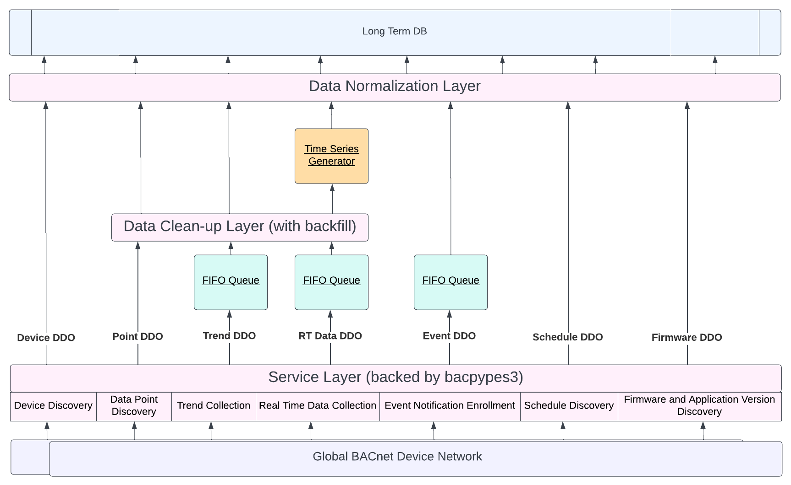

# BACnet Client
The BACnet Client module uses Joel Bender's Bacpypes3 python package as its BACnet stack in order to implement a service layer with the following interfaces: 
- Device discovery
- Point discovery
- Trend collection
- Real time data collection
- Event Notification
- Schedule discovery
- Firmware and application version discovery

Each service interface will support the *initialize* and *run* methods through its corresponding service class. The app.py file is the entry-point to the application, it is only in charge of declaring imports for each available service class, and calling the init and run methods for them all.

## Device Discovery
- Uses the bacpypes3 who-is native service interface to discover bacnet devices in a series of Async tasks that run on a loop.
> Will need manage the environment's firewall in order to fully control bacnet ip port management from the application side. (for example on Ubuntu 22.04) 
`sudo ufw allow from any to any port 47808 proto udp`
- Initializes the database with device data, creates a list of devices objects to track their state
- The device objects implement an Obvservable interface to update a document's field(s) if it chagned.
- The device list object also implements the Observable interface and either inserts or delete devices.
- implement object comparison operators and compare each device to the current state for any changes, if an existing device has changed state, change the model's state accordingly and emit a change of value event for observer implementations such as the database client.
- Once the database client receives the change of value event it will update the corresponding field on the database.

## Data Point Discovery

